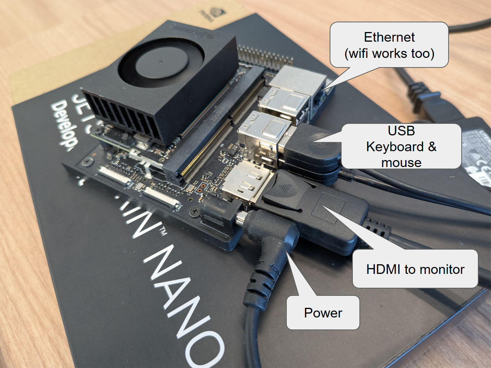

# Guide to install Gemma > Jetson Nano

## Prepare for Setup

To get started with Jetson Nano Developer Kit, please see [here](https://developer.nvidia.com/embedded/learn/get-started-jetson-nano-devkit).\
A typical setup will look like this.



Connect hdmi, usb keyboard & mouse and power

username: nvidia\
default password: nvidia

## Download Ollama

1. Open Terminal app\
Shortcut : Ctrl + Alt + T

2. Install curl\
```$ sudo apt install curl```

3. Install Ollama\
```$ curl -fsSL https://ollama.com/install.sh | sh```

4. Run\
```$ ollama run gemma2:2b "Write me a poem about the Kraken."```
