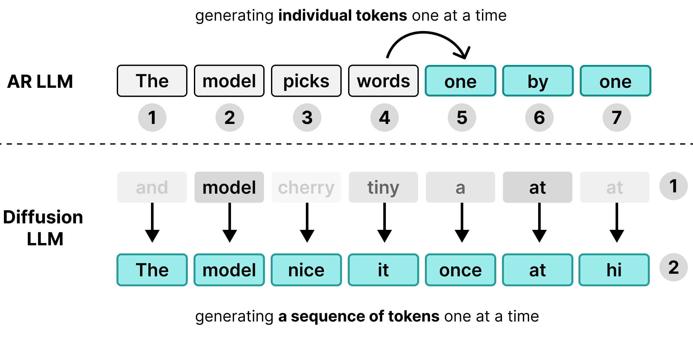
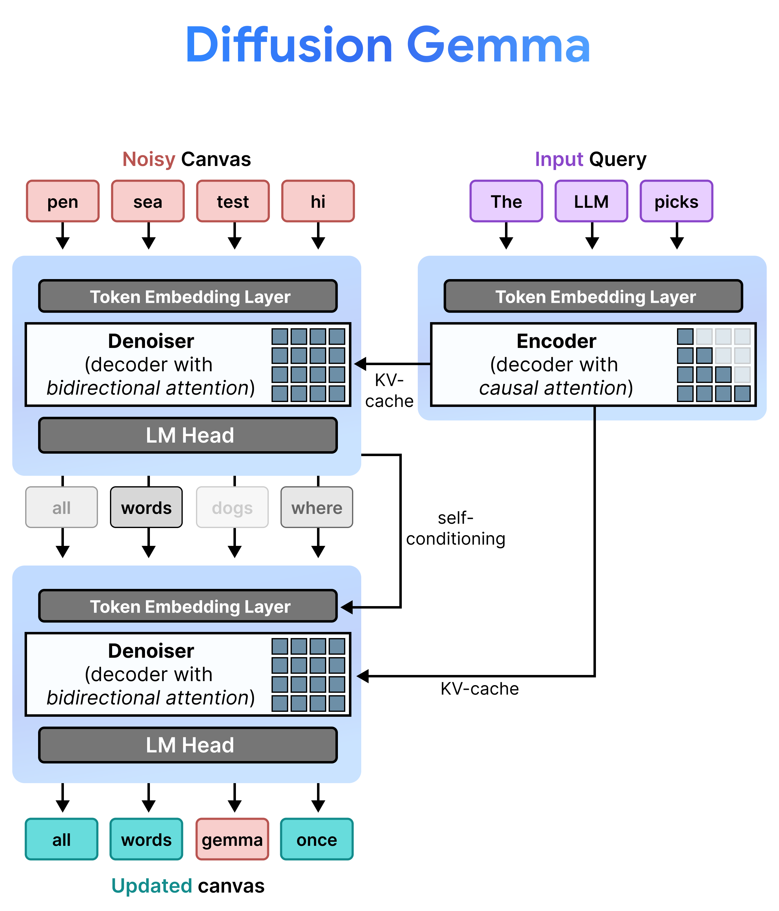
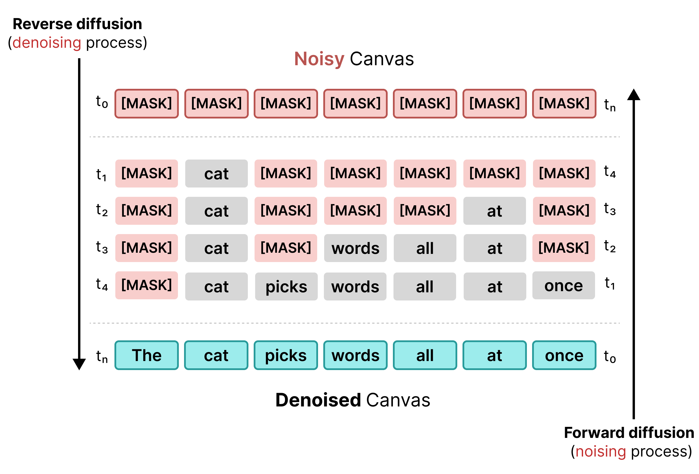
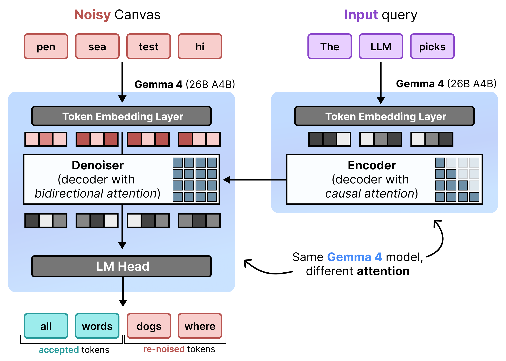

# Diffusion in Text Generation Explained

To understand DiffusionGemma, it helps to examine the core limitations of
standard language models and how text-based diffusion differs.

## The Problem with Autoregressive Models

Many Large Language Models (LLMs) are **autoregressive**, meaning they generate
text one single token at a time. While this approach works well for serving many
users simultaneously via batching, it creates a latency bottleneck for
individual users.

During the decoding phase, standard Transformer models are **memory-bound**
rather than compute-bound. Most of the generation time is spent loading model
weights from hardware memory into the processing units, rather than performing
the actual mathematical calculations. Because the weights only need to be loaded
once per step regardless of batch size, generating a token takes nearly the same
amount of time for 1 user as it does for 256 users grouped together.

Consequently, an individual user sees no latency advantage; the hardware's
computational capacity sits idle while waiting on memory transfers.

**DiffusionGemma** utilizes this idle compute time for the individual user.
Instead of generating 1 token for 256 separate users, it generates **256 tokens
at once** for a single user.

The model initializes a blank sequence of 256 random tokens—called a
**canvas**—and iteratively evaluates and refines the entire canvas
simultaneously. This shifts the model from being memory-bound to
**compute-bound**, allowing it to scale processing speeds efficiently as
computational power increases.

| Aspect | Text Autoregression | Text Diffusion |
| --- | --- | --- |
| **Token Generation** | One token at a time | A full canvas of tokens at once |
| **Steps** | One step for each token | One step for multiple tokens |
| **Generation Order** | Left-to-right | All positions in parallel |
| **Starting Point** | Empty sequence | Random tokens sampled from the vocabulary |
| **Error Correction** | Static; cannot revise past tokens | Dynamic; can revise any canvas position |
| **Hardware Bottleneck** | Memory-bound | Compute-bound |
| **Throughput Focus** | High multi-user throughput | Ultra-low single-user latency |

## Understanding Text Diffusion Mechanics

In image generation, diffusion models start with 100% random Gaussian noise and
progressively remove it (denoising) over multiple steps guided by a text prompt.
Translating this logic to text is more challenging because text tokens are
discrete entities, unlike continuous pixel values.

DiffusionGemma achieves text-based diffusion through a progression of
specialized methodologies:

### 1. Masked Diffusion

Early text diffusion relied on masking, similar to BERT training. Random tokens
in a sequence are replaced with a `[MASK]` token (representing noise). During
reverse diffusion, the model predicts the correct token behind the mask,
substituting tokens where confidence meets a specific threshold.

However, masked diffusion suffers from rigidity: once a `[MASK]` token is
replaced with a word, it is locked in. It cannot be corrected in later steps if
the surrounding context changes.

### 2. Uniform State Diffusion

To resolve the limitations of masking, DiffusionGemma uses **Uniform State
Diffusion**. Instead of an explicit `[MASK]` token, noise is introduced by
replacing original words with entirely **random tokens** from the vocabulary.

During the denoising process, the model analyzes the entire canvas to determine
which tokens are contextual noise and updates them. If a token is correct, it
retains a high probability. If a token's probability drops below a threshold due
to new context emerging in later steps, it is **re-noised** with a fresh random
token. This cycle allows continuous error correction and parallel canvas
refinement.

## Architecture: The incremental prefill and denoising

DiffusionGemma implements Uniform State Diffusion efficiently by alternating
between **Incremental Prefill** and **Denoising**. Gemma 4 26B A4B model isn't
used natively but fine-tuned to support the different tasks of denoising and
encoding. Rather than using separate models, a single backbone dynamically
toggles between two modes:

*   **Prefill / Incremental Prefill (Causal):** Uses causal attention to ingest
    the prompt context and write to the KV cache. This runs once to prefill the
    initial context and then once per block to append each finalized 256-token
    canvas to the KV cache before proceeding to denoising the next canvas.
*   **Denoising (Bidirectional):** Uses *bidirectional attention* to iteratively
    denoise the canvas. Query tokens at any position on the canvas can attend to
    all other canvas tokens (as well as KV cache), letting the model process
    context bidirectionally.

## Advanced Inference Frameworks

To move a canvas from pure noise to finalized text, DiffusionGemma utilizes a
collection of underlying decoding systems:

### Self-Conditioning

During inference, the decoder (also known as the denoiser) retains its previous
state. After completing a denoising step, it multiplies its generated
probability distribution matrix by the token embedding table. This produces a
localized vector representation carrying a memory of its prior predictions and
confidence metrics, which is passed directly into the next step.

### Multi-Canvas Sampling (Block Diffusion)

Because a single canvas is fixed to 256 tokens, DiffusionGemma chains diffusion
and autoregression together for long-form text. It runs diffusion cycles to
generate a full 256-token block, appends that completed block to the prompt
context, updates the encoder's KV cache, and kicks off a brand new 256-token
canvas diffusion cycle.

## Summary

Standard autoregressive language models generate text sequentially (one token at
a time), which makes them memory-bound and creates a latency bottleneck for
individual users. **DiffusionGemma** solves this by shifting to a compute-bound
model that generates a full 256-token "canvas" simultaneously.

By utilizing **Uniform State Diffusion**, the model replaces text with random
vocabulary noise and iteratively refines the entire canvas in parallel. It uses
a fine-tuned Gemma 4 26B A4B to support the different tasks of denoising and
encoding. Advanced frameworks like self-conditioning, multi-canvas block
sampling allow the model to dynamically correct errors, handle long-form
generation, and achieve ultra-low single-user latency.
